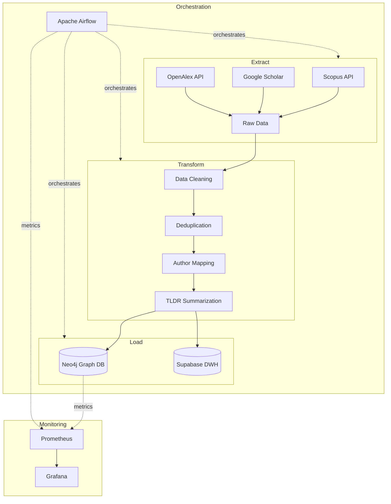

<div align="center">

# 🎓 UNESA Knowledge Graph

**Academic Knowledge Graph Construction & GraphRAG Pipeline**

[](https://gitlab.com/rizkyyanuark/Tugas_Akhir/-/pipelines)
[](https://python.org)
[](https://airflow.apache.org)
[](https://neo4j.com)

*End-to-end ETL pipeline for constructing a Knowledge Graph from academic publications of UNESA Faculty of Engineering lecturers, powered by Apache Airflow orchestration and Neo4j graph database.*

</div>

---

## 📋 Table of Contents

- [Overview](#overview)
- [Architecture](#architecture)
- [Tech Stack](#tech-stack)
- [Project Structure](#project-structure)
- [Getting Started](#getting-started)
- [Deployment](#deployment)
- [Monitoring](#monitoring)
- [Contributing](#contributing)

## Overview

This project builds an automated data pipeline that:

1. **Extracts** academic publication data from multiple sources (Scopus, Google Scholar, OpenAlex, Semantic Scholar)
2. **Transforms** raw data through cleaning, deduplication, author mapping, and AI-powered TLDR summarization
3. **Loads** structured data into Neo4j as a Knowledge Graph and Supabase as a relational data warehouse
4. **Serves** the Knowledge Graph via a GraphRAG (Graph Retrieval-Augmented Generation) interface

## Architecture



## Tech Stack

| Component | Technology | Purpose |
|-----------|-----------|---------|
| **Orchestration** | Apache Airflow 2.8.1 | DAG scheduling & workflow management |
| **Graph Database** | Neo4j 5.15 Enterprise | Knowledge Graph storage & querying |
| **Data Warehouse** | Supabase (PostgreSQL) | Relational data storage |
| **Vector Database** | Weaviate | Embedding storage for GraphRAG |
| **Monitoring** | Prometheus + Grafana | System & application metrics |
| **Reverse Proxy** | Nginx | Routing & load balancing |
| **CI/CD** | GitLab CI/CD | Automated build & deployment |
| **Cloud** | AWS EC2 + ECR | Production hosting |
| **DNS & Security** | Cloudflare | SSL, DNS, Zero Trust Access |

## Project Structure

```
Tugas_Akhir/
│
├── README.md                       # You are here
├── Makefile                        # Shortcut commands (make dev, make deploy)
├── .env.example                    # Environment variables template
├── .gitlab-ci.yml                  # CI/CD pipeline definition
├── pyproject.toml                  # Python project metadata
├── requirements.txt                # Python dependencies
│
├── src/                            # 🟢 Production Application Code
│   ├── etl/                        #    ETL Pipeline
│   │   ├── extract/                #    Data extraction (Scopus, Scholar, etc.)
│   │   ├── transform/              #    Cleaning, dedup, enrichment, TLDR
│   │   └── load/                   #    Supabase & Neo4j loaders
│   ├── backend/                    #    REST API (in development)
│   ├── frontend/                   #    Web UI (in development)
│   └── graphrag/                   #    GraphRAG retrieval (in development)
│
├── dags/                           # 🟢 Airflow DAG Definitions
│   ├── unesa_papers_dag.py         #    Main papers ETL pipeline
│   └── unesa_lecturers_dag.py      #    Lecturers data pipeline
│
├── plugins/                        # 🟢 Airflow Custom Plugins
│
├── infra/                          # 🟢 Infrastructure & DevOps
│   ├── docker/                     #    Docker configurations
│   │   ├── Dockerfile.airflow      #    Custom Airflow image (with Chromium)
│   │   ├── docker-compose.yml      #    Development environment
│   │   └── docker-compose.prod.yml #    Production environment
│   ├── nginx/                      #    Reverse proxy configuration
│   │   └── nginx.conf
│   ├── scripts/                    #    Server setup & maintenance
│   │   ├── setup_server.sh
│   │   └── setup_swap.sh
│   └── monitoring/                 #    Observability stack
│       ├── grafana/                #    Dashboards & provisioning
│       └── prometheus/             #    Metrics collection
│
├── notebooks/                      # 🔬 Research & Experiments
│   ├── scraping/                   #    Data scraping experiments
│   ├── training/                   #    ML model training (CPT + SFT)
│   └── build-graph/                #    KG construction prototypes
│
├── data/                           # 📊 Sample & Test Data
│
└── docs/                           # 📄 Academic Documents
    ├── proposal tugas akhir/       #    TA proposal (LaTeX)
    ├── supabase_new_schema.sql     #    Database schema reference
    └── flowchart.mmd               #    System flowchart (Mermaid)
```

## Getting Started

### Prerequisites

- [Docker](https://docs.docker.com/get-docker/) & Docker Compose
- [Python 3.10+](https://python.org)
- [Make](https://www.gnu.org/software/make/) (optional, for shortcut commands)

### Quick Start (Development)

```bash
# 1. Clone the repository
git clone https://github.com/rizkyyanuark/Tugas_Akhir.git
cd Tugas_Akhir

# 2. Copy and configure environment variables
cp .env.example .env
# Edit .env with your API keys and credentials

# 3. Start core services (Airflow + Neo4j)
make dev

# 4. Start with all profiles (includes monitoring & vector db)
make dev-all
```

### Available Make Commands

| Command | Description |
|---------|-------------|
| `make dev` | Start core services (Airflow + Neo4j) |
| `make dev-all` | Start all services (core + monitoring + vectordb) |
| `make down` | Stop all running services |
| `make logs` | Follow container logs |
| `make deploy` | Push to GitHub & GitLab (triggers CI/CD) |
| `make status` | Check GitLab pipeline status |
| `make help` | Show all available commands |

### Accessing Services (Development)

| Service | URL | Credentials |
|---------|-----|-------------|
| Airflow | [localhost:8080](http://localhost:8080) | `admin` / *(from .env)* |
| Neo4j Browser | [localhost:7474](http://localhost:7474) | `neo4j` / *(from .env)* |
| Grafana | [localhost:3000](http://localhost:3000) | `admin` / *(from .env)* |
| Prometheus | [localhost:9090](http://localhost:9090) | No auth |

## Deployment

Production deployment is automated via **GitLab CI/CD**. Pushing to the `main` branch triggers:

1. **Build Stage**: Docker image built and pushed to AWS ECR
2. **Deploy Stage**: Files SCP'd to EC2, Docker Compose up with monitoring

```bash
# Deploy to production
make deploy
```

### Production URLs

| Service | URL |
|---------|-----|
| Airflow | [airflow.tugasakhir.space](https://airflow.tugasakhir.space) |
| Neo4j | [neo4j.tugasakhir.space](https://neo4j.tugasakhir.space) |
| Grafana | [grafana.tugasakhir.space](https://grafana.tugasakhir.space) |
| Prometheus | [prometheus.tugasakhir.space](https://prometheus.tugasakhir.space) |

> **Note:** Production services are protected by Cloudflare Zero Trust Access (Email OTP).

## Monitoring

The monitoring stack includes:

- **Prometheus** — Collects metrics from Neo4j, Node Exporter, and Weaviate
- **Grafana** — Visualizes metrics with pre-configured dashboards
- **Node Exporter** — System-level metrics (CPU, RAM, Disk)

See [`infra/monitoring/README_MONITORING.md`](infra/monitoring/README_MONITORING.md) for detailed monitoring documentation.

## Contributing

1. Fork the repository
2. Create your feature branch (`git checkout -b feature/amazing-feature`)
3. Commit your changes (`git commit -m 'feat: add amazing feature'`)
4. Push to the branch (`git push origin feature/amazing-feature`)
5. Open a Pull Request

---

<div align="center">

**Rizky Yanuar Kristianto** — Sains Data, Universitas Negeri Surabaya (UNESA)

*Tugas Akhir 2025/2026*

</div>
